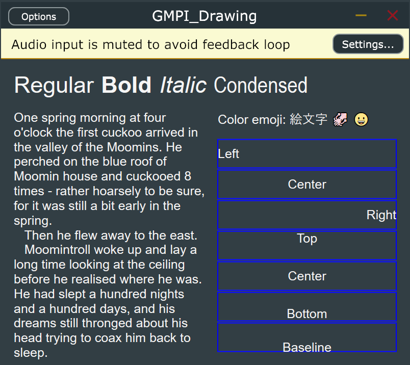
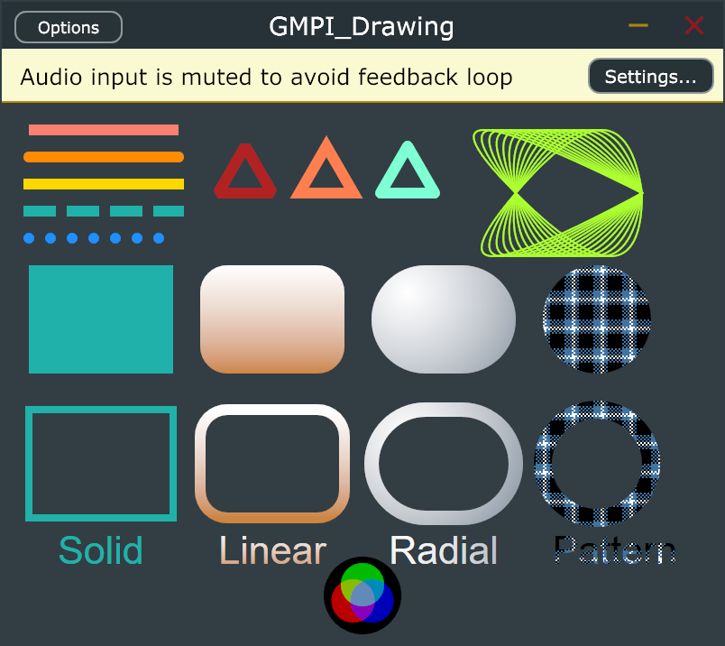

# GMPI-Drawing

A cross-platform drawing library for Windows and macOS

# Features

GMPI Drawing:
* Has a permissive open-source license
* An open standard. No fees, contracts or NDAs
* Has cross-platform support (Windows and macOS)
* Includes a cross-plaform Graphics option
* A clean and bloat-free API surface
* Provides all APIs in pure portable 'C' for maximum compatibility
* Text in all languages via UFT-8
* Color emojis
* Bitmap images
* Vector paths with lines, bezier curves, and arcs
* Solid, gradient, and tiled image fills
