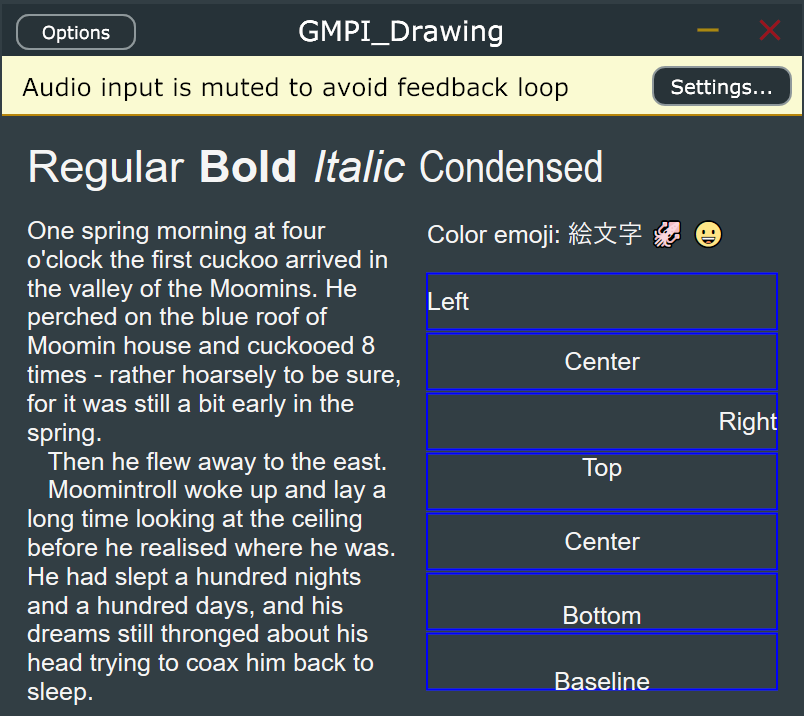
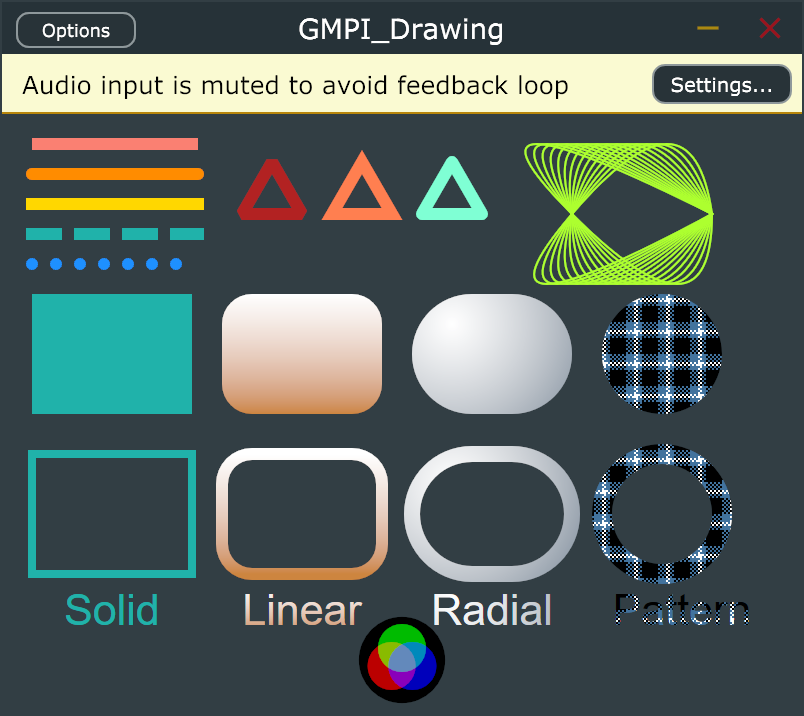

# GMPI-Drawing

A cross-platform drawing library for Windows and macOS which is lightweight and can be used in a shared library, which makes it a good fit for audio plugin GUIs.

For JUCE projects there is also a backend that renders through juce::Graphics (see `backends/JuceGfx.h`), which additionally supports any platform JUCE runs on (e.g. Linux).

# Features

GMPI Drawing:
* Has a permissive open-source license
* An open standard. No fees, contracts or NDAs
* Has cross-platform support (Windows and macOS)
* No dependancies except for the standard OS features, and the standard C++ library
* A clean and bloat-free API surface
* Provides all APIs in both C++ and in pure portable 'C' for maximum compatibility
* Uses the platforms native drawing (Cocoa / Direct-2D) to minimise overhead and build times.
* Optional JUCE backend (juce::Graphics) for use inside JUCE projects and on other platforms like Linux
* Text in any languages via UFT-8
* Color emojis
* Bitmap images
* Vector paths with lines, bezier curves, and arcs
* Solid, gradient, and tiled image fills
* Rotation, scaling and translation
* DPI aware