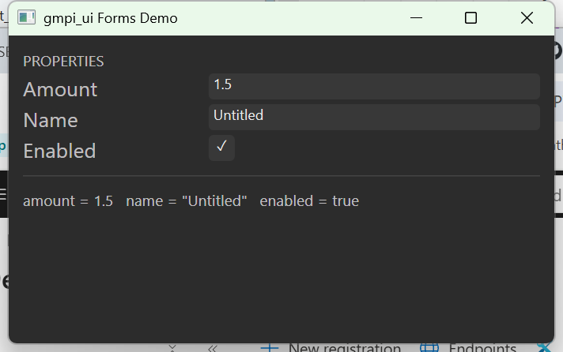

# FormsDemo

A standalone desktop app built from gmpi_ui's widget set and nothing else: a
window, a `gmpi::ui::Form`, and three controls - a number entry, a text entry
and a tick box - wired the way SynthEdit's PropertiesBrowser wires its rows
(`SynthEditLib/EditorLib/PropertiesBrowser.cpp`).



What it demonstrates:

* **Layout by grid.** A stack of rows (`auto_size` tracks), each a nested
  two-column grid: a fixed-width label column and a `1fr` editor column.
* **One-way bindings.** Widgets read a `gmpi_forms::State` the form owns.
  Edits arrive through the widget's `validateAndSave` back-channel, where the
  form validates, updates its model, and only then re-seeds the State. So
  `abc` typed into the number entry is rejected and the old value restored,
  and `1.50` over `1.5` counts as no change.
* **Rebuild-on-dirty rendering.** `Body()` is re-run whenever the model, the
  bounds or the theme change; the summary line is simply rebuilt.
* **An immutable model.** `Model` is a plain value; every committed edit
  appends a new one to an `immer::vector` (a persistent structure from
  [immer](https://github.com/arximboldi/immer), fetched by CMake), so each
  version is a cheap independent snapshot - the shape an undo stack wants.

Files:

| | |
| --- | --- |
| `DemoForm.h/.cpp` | the Form: model, States, `Body()` |
| `MainWin32.cpp` | the shell: an overlapped HWND hosting gmpi_ui's Direct2D `DrawingFrame` |
| `compat/it_enum_list.h` | shim for a SynthEdit SDK header `experimental/builders.cpp` includes |

## Building

Windows only for now (Win32 + Direct2D). GMPI is taken from a sibling
checkout (`../../../GMPI`) when there is one, else fetched from GitHub;
`-DGMPI_SDK_FOLDER_OVERRIDE=<path>` points it elsewhere. immer is always
fetched (header-only, pinned to a release tag in `CMakeLists.txt`).

```
cmake -S . -B build -G "Visual Studio 18 2026" -A x64
cmake --build build --config Debug
build\Debug\FormsDemo.exe
```
